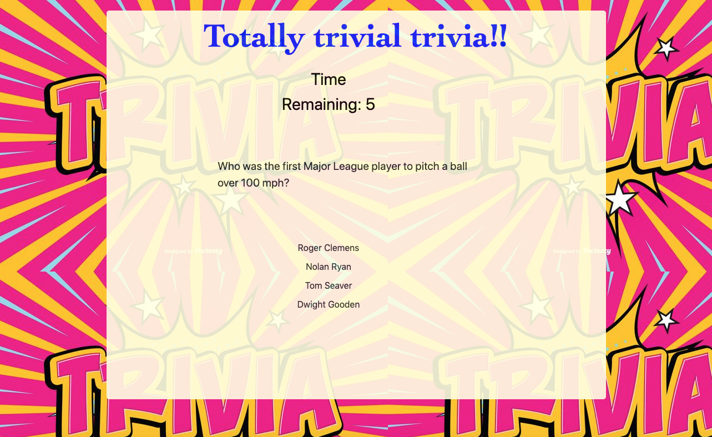
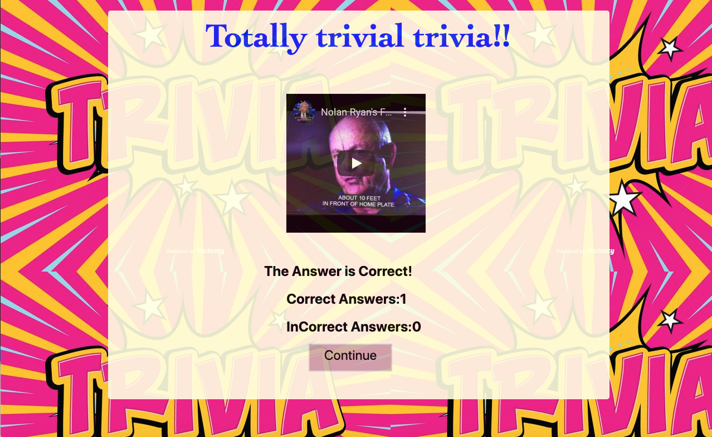

#**TRIVIA GAME**#

This repository is for a Javascript game, using Jquery Bootstrap styling, including buttons, and setInterval functionality. The game contains a Javascript file to run the game, an html and css file, and images used in the game. The styling is created through the use of bootstrap, a css file, and within the html file.

The game is a trivia game with questions employing a basebal theme. It consists of seven questions, displayed one at a time; each one must be answered in 15 seconds.

1. Game starts when the player clicks the start button. A multiple-choice question is displayed, with a time counter.After the user answers, a new page is prompted, containing a video related with the answer, and also the player's stats, i.e,  the number of right, and wrong questions.

      

2. After the user answers, a new page is prompted, containing a video related with the answer, and also the player's stats, i.e,  the number of right, and wrong questions.

   
     

3. The scenario is similar for time-outs.

4. Once the final question is answered, a page is prompted containing not only the video related to the corect answers, but also the final stats of the player. An option to restart the game is displayed as well.

  

This project is deployed at https://leopard-2019.github.io/TriviaGame/

