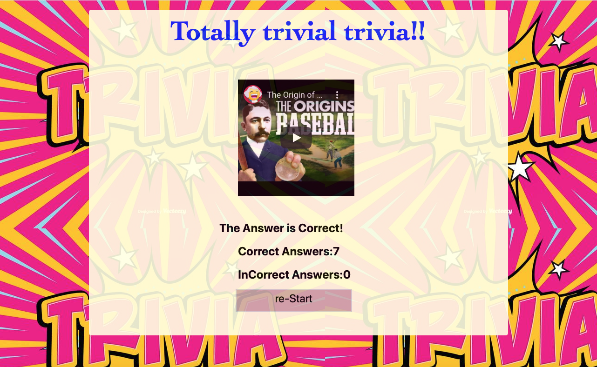

**#TRIVIA GAME**

I have created a Trivia game about baseball using JavaScript for the logic and jQuery to manipulate HTML. This is how this game works:

1. The game shows only one question until the player answers it or their time runs out.

      

2. If the player selects the correct answer, the correct answer is displayed anyway with a video related to it A continue button has been  created so the player can watch the video is desired, and the then click the this button so the next question is displayed.
   
     

3. The scenario is similar for wrong answers and time-outs.

4. On the final screen, the number of correct answers, incorrect answers, and an option to restart the game are displayed.

       

This app can be accessed by this link: https://leopard-2019.github.io/TriviaGame/

